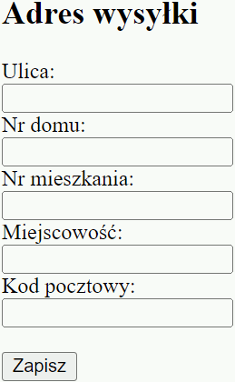
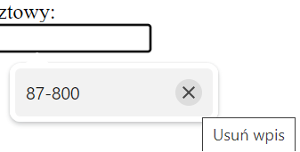
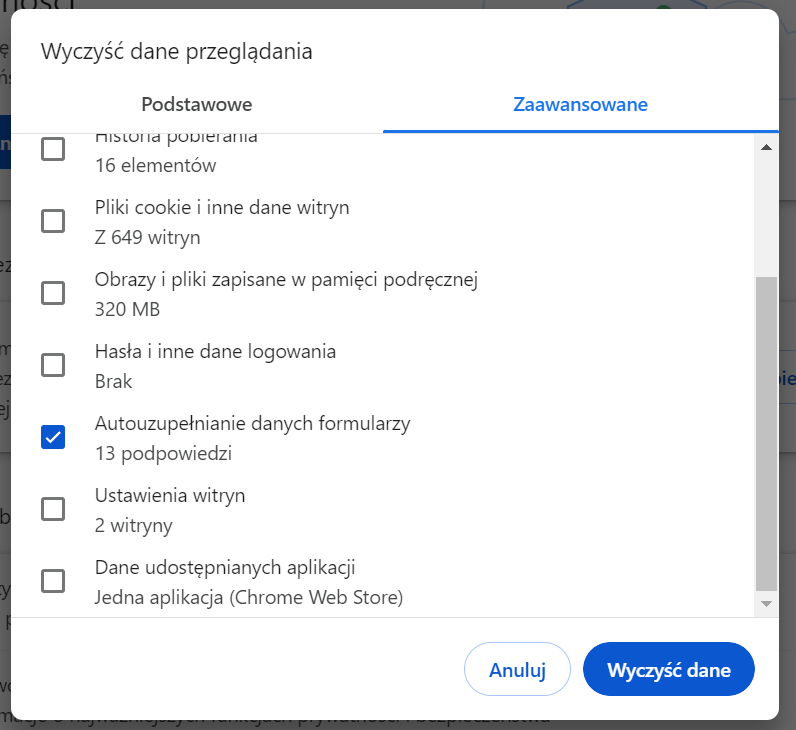
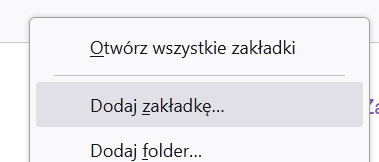
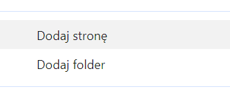
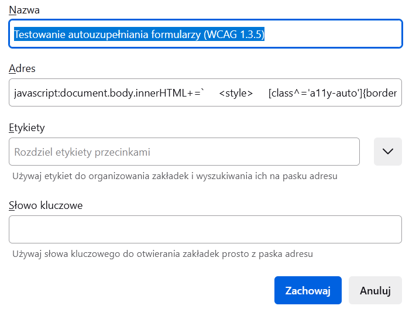
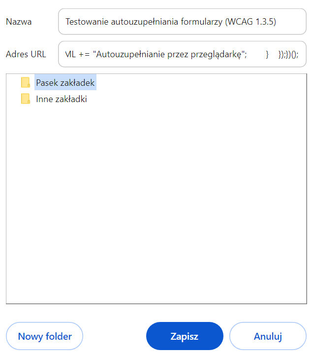
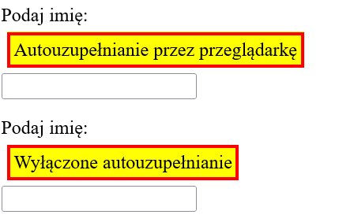
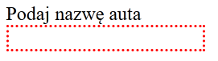
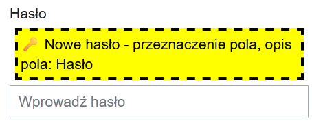

# <h1>Testowanie autouzupełniania formularzy (WCAG 1.3.5)</h1>8

Międzynarodowe wytyczne WCAG dają zestaw wymagań dla stron internetowych. Ich spełnienie pozwala **osobom z niepełnosprawnościami** korzystać ze stron internetowych. 

## Teoria 1.3.5 WCAG

### Autouzupełnianie - na czym to polega?

<p>Pola formularzy mogą zapamiętywać wprowadzane wartości. Pozwala to szybciej wypełnić formularz. <p>


### Ważne informacje
<p>Technikę stosuje się wyłącznie do danych dotyczących osoby, która wypełnia formularz (<a href="https://www.w3.org/WAI/WCAG21/Techniques/html/H98">Technika H98 WCAG</a>). Dane są zapisywane dopiero po kliknięciu na przycisk np. wyślij lub zapisz. </p>

<p>Pole formularza w kodzie strony musi mieć informację, z której grupy danych chce uzupełniać pola formularza (wartość autocomplete musi być konkretna i zgodna z <a href="https://www.w3.org/TR/WCAG21/#input-purposes">HTML 5.2</a>). Błędna wartość "autocomplete" to błąd!</p>
<p>Unikaj używania: </p>
<ul><li>
 <code>autocomplete="on"</code>. To nie jest pomocne, bo przeglądarka "zgaduje" jak wypełnić pole.</li>
 <li> <code>autocomplete="off"</code>. To utrudnia osobom z niepełnosprawnościami korzystanie ze stron. Menadżer haseł i tak może zignorować takie ustawienie, dlatego nie chroni to haseł. </li>
 </ul>


### Komu to pomaga?

<p>Jest to szczególne pomocne dla osób z niepełnosprawnościami. Wiele grup osób skorzysta z autouzupełniania, np. osoby:<p>

<ul>
<li>z uszkodzonymi lub amputowanymi kończynami górnymi,</li>
<li>sparaliżowane (korzystają z wirtualnych klawiatur),</li>
<li>wrodzononymi wadami kończyn górnych,</li>
<li>niedowładami dłoni,</li>
<li>chorobami i schorzeniami wpływającymi na posługiwanie się sprzętem np. udar, choroba Parkinsona,</li>
<li>chorobami otępiennymi i zaburzającymi pamięć np. choroby naczyniowe, demencje, wirus HIV, urazy głowy,</li>
<li>porażeniem mózgowym.</li>
</ul>

<p>Są tu dwie możliwości wsparcia użytkownika:</p>
<ul>
<li>szybsze uzupełnianie danych,</li>
<li>wyświetlenie dodatkowych ikon wspierających użytkowników z chorobami otępiennymi i innymi. Zainstalowana nakładka na podstawie kodu strony może wyświetlić ikonę, która w łatwiejszy sposób pozwala zrozumieć jakich danych oczekuje formularz.</li>
</ul>
<p>Z tego rozwiązania korzystają także osoby, których stan zdrowia jest bardzo dobry. Docenią to także obcokrajowcy i dyslektycy.</p>

## Praktyka 1.3.5 WCAG
### Przykładowy kod 
```HTML
        <label for="name">Imię i nazwisko</label>
        <input id="name" type="text" autocomplete="name">
```
Serce tej techniki to <code>autocomplete="name"</code>. Jest określony zbiór wartości dla atrybutu <code>autocomplete</code>. Musisz używać wskazane w <a href="https://www.w3.org/TR/WCAG21/#input-purposes">HTML 5.2</a>. Zwróć uwagę, że zupełnie inny jest dla imienia i nazwiska oraz dla samego imienia.

<p>Błędna wartość lub literówka w "autocomplete" to błąd!</p>

```HTML
<label for="given-name">Imię</label>
<input id="given-name" type="text" autocomplete="given-name">
```


        
###  Przydatne linki (w języku angielskim)
<ul>
<li><a href="https://www.w3.org/WAI/WCAG21/Understanding/identify-input-purpose.html">Szczegóły kryterium sukcesu 1.3.5 WCAG</a>,</li>
<li><a href="https://www.w3.org/WAI/WCAG21/Techniques/html/H98">Technika H98 WCAG</a> (przykładowy kod),</li>
<li>Słów kilka o <a href="https://www.w3.org/TR/WCAG21/#input-purposes">HTML 5.2</a> czyli wartości jakie są dopuszczalne w atrybucie "autocomplete".</li>

</ul>

### Kontrowersje i mit bezpieczeństwa
<p> Autouzupełnianie często jest wyłączane ze względów bezpieczeństwa. Jest to mylne podejście, ponieważ jego wyłączenie dotyczy także zaufanych i bezpiecznych komputerów. Nie chroni to przed kradzieżą danych, ponieważ duża część metod polega na zapisywaniu wartości wprowadzanych z klawiatury. </p>
<p>Użytkownik musi używać tej samej przeglądarki, aby móc skorzystać z wcześniej wpisanych danych. Na innej przeglądarce lub komputerze nie będzie dostępu do tych danych. Dodatkowo musi przynajmniej raz je wprowadzić i wysłać.</p>
<p>Użytkownik może zarządzać danymi przechowywanymi przez przeglądarkę i jemu należy zostawić wybór. Przeglądarka w "trybie prywatnym" powinna ignorować zapisywanie danych z formularzy. </p>
<p>
Unikanie używania atrybutu "autocomplete" nie chroni użytkownika przed zapisywaniem danych z formularzy przez przeglądarkę, ale za to na pewno dyskryminuje osoby z niepełnosprawnościami i narusza prawo. W wielu krajach zgodność z wybranymi punktami WCAG jest obowiązkowe.
</p>
<p>Przykład jak usuwać dane autouzupełniania z Chrome:</p>
<ul><li>Wypełniajac formularz możesz zdecydować, które dane nie są już potrzebne. Po wyświetleniu propozycji autouzupełnienia przejdź myszą lub tabulatorem do podpowiedzi i wybierz "x". Usunie to autouzupełnienie dla tego rodzaju pola. <br> 
</li>
<li>Możesz usunąć wszystkie dane wprowadzone w wybranym czasie. Kliknij trzy kropki w prawym górnym rogu i wybierz "Ustawienia". Znajdź i kliknij zakładkę "Prywatność i bezpieczeństwo", a następnie "Wyczyść dane przeglądania". Wybierz zakładkę "Zaawansowane" i wybierz okres czasu np. "Ostatnie 24 godziny". Zaznacz "Autouzupełnianie danych formularzy".<br> </li></ul>

### Autouzupełnianie prawidłowe kontra autouzupełnianie przeglądarki

<p>Są trzy rodzaje autouzupełniania danych:</p>
<ul>
<li>menadżer hasła może wprowadzać hasło i login,</li>
<li>autouzupełnianie w oparciu o <a href="https://www.w3.org/TR/WCAG21/#input-purposes">HTML 5.2</a> czyli poprawne wartości atrybytu "autocomplete",</li>
<li>autouzupełnianie na podstawie algorytmów przeglądarki <code>autocomplete="on"</code>.</li>
</ul>

<p>Autouzupełnianie formularzy na podstawie algorytmów przeglądarki to próby zgadnięcia jak wypełnić pole. Próby są zależne od przeglądarki. Nie jest to bezbłędne narzędzia. Unikaj używania <code>autocomplete="on"</code>. </p>

## Jak używać narzędzia
### Instalacja
#### Wersja prosta
<ol>
<li>Wyświetl pasek zakładek. W Firefoxie i Chrome to skrót <code>Ctrl + Shift + B</code>.</li>
<li>Przeciągnij link na pasek zakładek, aby pojawiła się na pasku. Link to skryptozakładka (bookmarklet) <a href="javascript:document.body.innerHTML+=`     <style>     [class^='a11y-auto']{border: 3px dashed black; background: yellow !important; color: black !important; padding:3px; display: inline-block; margin: 5px; z-index: 99999}     .a11y-auto-name::before {content: '\\1F464 \\0020 Tytu%C5%82y, imi%C4%99, nazwisko'}     .a11y-auto-honorific-prefix::before{content: '\\1F464 \\0020 Tytu%C5%82 (np. Pan, Pani, Dr, Prof.)'}     .a11y-auto-given-name::before{content: '\\1F464 \\0020 Imi%C4%99'}     .a11y-auto-additional-name::before{content: '\\1F464 \\0020 Drugie imi%C4%99'}     .a11y-auto-family-name::before{content: '\\1F464 \\0020 Nazwisko'}     .a11y-auto-honorific-suffix::before{content: '\\1F464 \\0020 Suffix (ameryka%C5%84skie i zachodnioeuropejskie dodatki na ko%C5%84cu, kt%C3%B3re nadaj%C4%85 nowe         znaczenie np. junior, senior, II. Mo%C5%BCe te%C5%BC tytu%C5%82 naukowy lub honorowy)'}     .a11y-auto-nickname::before{content: '\\1F464 \\0020 Pseudonim'}     .a11y-auto-organization-title::before{content: '\\1F454 \\0020 Stanowisko'}     .a11y-auto-username::before{content: '\\1F464 \\0020 U%C5%BCytkownik'}     .a11y-auto-new-password::before{content: '\\1F511 \\0020 Nowe has%C5%82o'}     .a11y-auto-current-password::before{content: '\\1F511 \\0020 Obecne has%C5%82o'}     .a11y-auto-organization::before{content: '\\1F3E2 \\1F3ED \\1F3EA \\0020 Organizacja/Nazwa firmy'}     .a11y-auto-street-address::before{content: '\\1F3E0 \\0020 Adres - ulica'}     .a11y-auto-address-line1::before{content: '\\1F3E0  \\0020 Ulica - linia 1'}     .a11y-auto-address-line2::before{content: '\\1F3E0  \\0020 Ulica - linia 2'}     .a11y-auto-address-line3::before{content: '\\1F3E0  \\0020 Ulica - linia 3'}     .a11y-auto-address-level4::before{content: '\\1F3E0 \\1F3E2 \\1F3ED \\0020 Adres miasto (czwarty poziom podzia%C5%82u kraju)'}     .a11y-auto-address-level3::before{content: '\\1F3E0 \\0020 Adres gmina (trzeci poziom podzia%C5%82u kraju)'}     .a11y-auto-address-level2::before{content: '\\1F3E0 \\0020 Adres powiat (drugi poziom podzia%C5%82u kraju)'}     .a11y-auto-address-level1::before{content: '\\1F3E0 \\0020 Adres wojew%C3%B3dztwo (lub stan, kanton - najwy%C5%BCszy poziom podzia%C5%82u kraju)'}     .a11y-auto-country::before{content: '\\1F3E0 \\1F5FA \\0020 Kod kraju (np. PL lub DE. Sk%C5%82ada si%C4%99 z dw%C3%B3ch liter, zgodny z ISO 3166-1 alfa-2)'}     .a11y-auto-country-name::before{content: '\\1F3E0 \\1F5FA \\0020 Kraj'}     .a11y-auto-postal-code::before{content: '\\1F4EB \\0020 Kod pocztowy'}     .a11y-auto-cc-name::before{content: '\\1F4B3 \\1F464 \\0020 Imi%C4%99 i nazwisko na dokumencie p%C5%82atniczym'}     .a11y-auto-cc-given-name::before{content: '\\1F4B3 \\1F464 \\0020 Imi%C4%99 na dokumencie p%C5%82atniczym'}     .a11y-auto-cc-additional-name::before{content: '\\1F4B3 \\1F464  \\0020 Drugie imi%C4%99 na dokumencie p%C5%82atniczym'}     .a11y-auto-cc-family-name::before{content: '\\1F4B3 \\1F464 \\0020 Nazwisko na dokumencie p%C5%82atniczym'}     .a11y-auto-cc-number::before{content: '\\1F4B3 \\0020 Numer karty p%C5%82atniczej'}     .a11y-auto-cc-exp::before{content: '\\1F4B3 \\1F4C6 \\0020 Data wa%C5%BCno%C5%9Bci karty p%C5%82atniczej'}     .a11y-auto-cc-exp-month::before{content: '\\1F4B3 \\1F4C6 \\0020 Miesi%C4%85c wa%C5%BCno%C5%9Bci karty p%C5%82atniczej'}     .a11y-auto-cc-exp-year::before{content: '\\1F4B3 \\1F4C6 \\0020 Rok wa%C5%BCno%C5%9Bci karty p%C5%82atniczej'}     .a11y-auto-cc-csc::before{content: '\\1F4B3 \\1F511 \\0020 Kod bezpiecze%C5%84stwa karty p%C5%82atniczej (np. CVC)'}     .a11y-auto-cc-type::before{content: '\\1F4B3 \\0020 Rodzaj karty p%C5%82atniczej (np. Visa albo Master Card)'}        .a11y-auto-transaction-currency::before{content: '\\1F4B0 \\0020 Waluta transakcji (trzyliterowy kod np. PLN, USD, GBP, zgodny z ISO         4217)'}        .a11y-auto-transaction-amount::before{content: '\\1F4B0 \\0020 Kwota transakcji (liczba zmiennoprzecinkowa)'}      .a11y-auto-language::before{content: '\\1F5E3 \\0020 Preferowany j%C4%99zyk (kod j%C4%99zyka, zgodny z BCP 47)'}         .a11y-auto-bday::before{content: '\\1F382 \\0020 Data urodzin'}       .a11y-auto-bday-day::before{content: '\\1F382 \\0020 Dzie%C5%84 urodzin'}       .a11y-auto-bday-month::before{content: '\\1F382 \\0020 Miesi%C4%85c urodzin'}         .a11y-auto-bday-year::before{content: '\\1F382 \\0020 Rok urodzin'}       .a11y-auto-sex::before{content: '\\1F6BA \\1F6B9 \\0020 P%C5%82e%C4%87'}         .a11y-auto-url::before{content: '\\1F4BB \\0020 Adres strony internetowej'}         .a11y-auto-photo::before{content: '\\1F4F7 \\0020 Zdj%C4%99cie (adres url)'}        .a11y-auto-tel::before{content: '\\1F4DE \\0020 Telefon (z numerem kierunkowym kraju np. +48)'}       .a11y-auto-tel-country-code::before{content: '\\1F4DE \\1F5FA \\0020 Numer kierunkowy kraju np. +48)'}       .a11y-auto-tel-national::before{content: ' \\1F4DE \\0020 Telefon (bez kierunkowego do regionu np. 22)'}      .a11y-auto-tel-area-code::before{content: '\\1F4DE \\0020 Kierunkowy do regionu np. 22'}      .a11y-auto-tel-local::before{content: '\\1F4DE \\0020 Telefon (bez kierunkowego kraju i regionu)'}      .a11y-auto-tel-local-prefix::before{content: '\\1F4DE \\0020 Pierwsza cz%C4%99%C5%9B%C4%87 telefonu (podzia%C5%82 telefonu na dwa, bez kierunkowych)'}     .a11y-auto-tel-local-suffix::before{content: '\\1F4DE \\0020 Druga cz%C4%99%C5%9B%C4%87 telefonu (podzia%C5%82 telefonu na dwa, bez kierunkowych)'}       .a11y-auto-tel-extension::before{content: '\\1F4DE \\0020 Telefon wewn%C4%99trzny'}       .a11y-auto-email::before{content: '\\1F4E7 \\0020 E-mail'}       .a11y-auto-impp::before{content: '\\1F4BB \\0020 Adres url punktu ko%C5%84cowego protoko%C5%82u wiadomo%C5%9Bci (np.: aim:goim?screenname=przyklad)'}       input:not([autocomplete]), textarea:not([autocomplete]), select:not([autocomplete]){border:2px dotted red !important;}     .a11y-auto-on{border: 3px solid red; background: white}     .a11y-auto-off{border: 3px solid red; background: white}     </style>     `,document.querySelectorAll('[autocomplete]').forEach(e=>{let o=document.createElement('span');if('none'!=e.style.display&&(e.before(o),o.tabIndex=0),'off'!=e.getAttribute('autocomplete')&&'on'!=e.getAttribute('autocomplete')){if(o.innerHTML+=' - przeznaczenie pola',e.getAttribute('id')||e.getAttribute('aria-label')){let t=document.querySelectorAll('[for='+e.getAttribute('id')+']');t[0]&&(o.innerHTML+=', opis pola: '+t[0].innerHTML),e.getAttribute('aria-label')&&(o.innerHTML+=', opis pola: '+e.getAttribute('aria-label'))}o.className='a11y-auto-'+e.getAttribute('autocomplete')}'off'==e.getAttribute('autocomplete')&&(o.className='a11y-auto-off',o.innerHTML+='Wy%C5%82%C4%85czone autouzupe%C5%82nianie'),'on'==e.getAttribute('autocomplete')&&(o.className='a11y-auto-on',o.innerHTML+='Autouzupe%C5%82nianie przez przegl%C4%85dark%C4%99')});">Testowanie autouzupełniania formularzy (WCAG 1.3.5)</a>.</li></ol>

#### Wersja alternatywnej instalacji
<ol>
<li>Wyświetl pasek zakładek. W Firefoxie i Chrome to skrót <code>Ctrl + Shift + B</code>.</li>
<li>Kliknij prawym przyciskiem na pasek zakładek. W Firefoxie wybierz "Dodaj zakładkę...", a w Chrome "Dodaj stronę".<br>
<br>
</li>
<li>W polu "Nazwa" dodaj tekst "WCAG 1.3.5" lub dowolny inny. Jest to etykieta pod jaką będzie wyświetlane narzędzie.<br>
<br>
</li>
<li><a href="./code/zakladka.js">Skopiuj treść kodu</a> i wklej go w "Adres"/"Adres URL". </li>
<li>Zapisz. W Firefoxie kliknij "Zachowaj", a w Chrome "Zapisz".</li>
</ol>

### Testowy formularz
<a href="./site/form.html">Możesz potestować narzędzie na stronie z przykładowymi polami formularza.</a>. Zapisz formularz na swoim komputerz i otwórz go w przeglądarce internetowej. Użyj narzędzia do testowania.

### Informacje o narzędziu
<ol>
<li>Narzędzie ignoruje pola ukryte (<code>display=none</code>).</li>
<li>Pola z atrybutem "autocomplete" ustawionym na "on" lub "off" są błędem. Są zaznaczone komentarzem: "Autouzupełnianie przez przeglądarkę" lub "Wyłączone autouzupełnianie".<br>
</li>
<li>Pola bez atrybutu "autocomplete" są zaznaczone obramowaniem złożonym z kółek. To również może być błędem, jeśli istnieje wartość dla "autocomplete" dla pola formularza.<br></li>
</ol>

<p>Programiści popełniają błędy tworząc formularze. Narzędzie nie jest w stanie uwzględnić wszystkie kombinacje złego kodu (np. jeden z dużych polskich portali ma pola formularza ukryte za pomocą techniki <code>left: -10000px;</code>). W przypadku dziwnego zachowania narzędzia sprawdź kod strony. Jest duża szansa, że formularz ma błędy.</p>

<p>Jeżeli wina leży w narzędziu WCAG 1.3.5 to proszę skontaktuj się ze mną.</p>

### Jak urchomić narzędzie i testować?

#### Jak uruchomić?
<ol>
<li>Wejdź na stronę, którą chcesz zbadać.</li>
<li>Kliknij w skryptozakładkę (bookmarklet).</li>
<li>Przejście do kolejnego kroku w formularzu wymaga odświeżenia strony. Także ponowne sprawdzenie kodu wymaga odświeżenia strony i kliknięcie w zakładkę.</li>
</ol>

<p></p>

#### Jak testować?

<p>Narzędzie sprawdza czy pole w formularzu ma wymagane autouzupełnianie. </p>

<ul>
<li>Wymóg autouzupełniania dotyczy tylko danych użytkownika, który wypełnia formularz.</li>
<li>Wyłączone autouzupełnianie lub zostawione przeglądarce to błąd. Musisz korzystać z <a href="https://www.w3.org/TR/WCAG21/#input-purposes">HTML 5.2</a> czyli autouzupełniania z prawidłowymi wartościami</a>. </li>
<li>Przeczytaj sekcje "dodatkowe informacje". Pola formularza bez autouzupełniania to zazwyczaj błąd. </li>
<li>Pola, które powinny mieć autouzupełnianie są opisane w linku dot. <a href="https://www.w3.org/TR/WCAG21/#input-purposes">HTML 5.2</a>. Możesz też sprawdzić <a href="./site/form.html">testowy formularz</a>. Zawiera on wszystkie rodzaje wymaganych pól z autouzupełnianiem. Zapisz sobie na komputerze i otwórz w przeglądarce, a następnie użyj narzędzia.</li>
<li>Literówka lub błędna wartość to błąd np. literówka w słowie "name" <code> autocomplete="given-naem"></code> lub autouzupełnianie dla kraju ustawione na pocztę.


```HTML
        <label for="country">Podaj kraj</label>
        <input id="country" type="text" autocomplete="postal-code">
```
</li>
<li>Informacje o autouzupełnianiu składa się z kilku części. Ikony, która podpowiada do jakiej grupy należy pole (kluczyk symbolizujące hasło). Informacji o tym jaką grupą danych będzie zasilane autouzupełnianie (Nowe hasło). Na końcu jest informacja o etykiecie pola formularza (Hasło). Etykieta pobierana jest z <code>label</code> lub <code>aria-label</code>.<br>
</li>
</ul>

### Kontakt
Proszę napisz do mnie e-mail: zglos.blad.programowanie@gmail.com.


